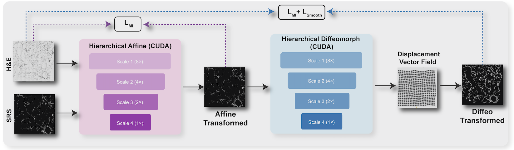

# HiMReg: Hierarchical Multimodal Image Registration

HiMReg is a GPU-accelerated hierarchical registration framework for cross-modal biomedical images. It aligns images across domains (H&E histology, SRS microscopy, fluorescence, MALDI mass spectrometry) using a coarse-to-fine multi-resolution pipeline.

The framework supports three registration modes:
- **Affine** — rigid + affine alignment with constrained parameterization
- **Diffeomorphic** — affine followed by compositional displacement field refinement
- **B-spline** — affine followed by multi-resolution B-spline nonlinear registration (Elastix-style)



## Method

### Two-Stage Affine Pipeline: Rigid then Affine

Registration is split into a **rigid stage** (3 DoF: rotation + translation) followed by a full **affine stage** (6 DoF). Optimizing translation and rotation first with fewer parameters avoids early overfitting to shear/scale, providing a stable initialization for the subsequent affine refinement.

### Multi-Resolution Gaussian Pyramid

Both stages iterate coarse-to-fine through a Gaussian pyramid (e.g., scales 10→8→6→4→3→2→1). Coarse levels capture large displacements with a smooth loss landscape; fine levels recover sub-pixel accuracy. Each pyramid level uses independently tuned learning rates, iteration counts, and early stopping patience.

### Per-Stage Learning Rates

The rigid and affine stages use separate learning rate schedules. The rigid stage uses aggressive learning rates (1.0 → 0.005 across scales) to enable large translational corrections (>100 px), while the affine stage uses conservative rates (0.005 → 0.0001) to avoid destabilizing the alignment with excessive shear or scaling. This prevents the optimizer from being trapped near the identity when large initial offsets exist.

### Physical-Space Parameter Scaling

Rotation and translation parameters operate at very different scales — a 1-unit change in rotation angle has a far larger effect than a 1-unit change in pixel translation. Parameter scaling normalizes these units so that the optimizer treats a 1-pixel physical shift equivalently across all parameters, preventing translation from dominating rotation or vice versa.

### Automatic Centroid Initialization

Before optimization, tissue masks are detected in both fixed and moving images, and the rigid translation parameters are initialized to the centroid displacement. This provides a warm start that places the images in approximate overlap, reducing the distance the optimizer must traverse.

### Center of Rotation

Rotation is applied around the image center or the tissue centroid rather than the coordinate origin. This decouples rotational and translational updates — small angle corrections no longer induce large spurious translations.

### Composite Loss Function (MI + GradNCC)

A weighted combination of **Mutual Information** and **Gradient Normalized Cross-Correlation** is used. MI captures global statistical dependencies between modalities, while GradNCC enforces local structural consistency at tissue boundaries. Per-scale metric scheduling allows using MI alone at coarse levels (where gradient signal is weak) and adding GradNCC at finer levels.

### Adaptive MI Histogram Bins

The number of MI histogram bins is adjusted per pyramid level — fewer bins at coarse scales (where image resolution is low) and more bins at fine scales (where intensity detail is richer). This prevents overfitting the joint histogram at low resolution while preserving discriminative power at high resolution.

### Tissue-Masked Loss Computation

Loss is computed only over detected tissue regions, ignoring background. This focuses the optimization on aligning actual biological structures rather than matching empty background areas, which is especially important for sparsely filled tissue sections.

### Stratified Spatial Sampling for MI

Instead of computing MI over all pixels, a fixed number of samples are drawn via stratified spatial sampling — the image is divided into equal strata and one sample is drawn per stratum. This gives uniform spatial coverage with lower variance than random sampling, accelerating each iteration while maintaining gradient quality.

### Scale-Dependent Patience

Early stopping patience is scaled with pyramid level — coarse levels receive higher patience (up to 4x) to allow the optimizer to escape local minima in the smoother landscape, while fine levels use the base patience to avoid wasting iterations on diminishing returns.

### B-Spline Nonlinear Refinement

After affine alignment, an optional multi-resolution B-spline stage applies local deformations through a free-form deformation grid. The grid spacing decreases across resolutions, progressing from global warping to local tissue-level corrections. Bending energy regularization can be applied to penalize excessive local distortion.

## Installation

```bash
git clone https://github.com/yourusername/HiMReg.git
cd HiMReg
pip install -r requirements.txt
```

Requires Python 3.8+ and a CUDA-capable GPU (CPU fallback supported but slow for large images).

## Quick Start

All entry points are configured via `config.yaml` or command-line flags.

### 1. Register a pair of images

Edit the `io` section of `config.yaml`:

```yaml
io:
  fixed: "data/maldi/he_rescale.tif"     # Path to fixed/reference image
  moving: "data/maldi/redox_rescale.tif" # Path to moving image to align
  output: "pred"                          # Output directory
  device: "cuda"                          # cuda | cpu

registration:
  register_type: "bspline"                # affine | diff | bspline
```

Then run:

```bash
python HiMReg.py --config config.yaml
```

**Outputs** (saved to `pred/`):
| File | Description |
|------|-------------|
| `*_affine.tif` | Affine-aligned result |
| `*_diff.tif` | Nonlinear-aligned result (diff/bspline modes) |
| `*_coords.npy` | Deformation grid `[1, H, W, 2]` for reuse |
| `*_diff_overlay.png` | Before/after RGB overlay |

### 2. Apply a saved transform to new images

```bash
python apply_transform.py \
    --coords pred/maldi/redox_rescale_coords.npy \
    --images data/maldi/redox_rescale.tif
```

`--images` accepts multiple space-separated paths. Omit `--output` to auto-name results as `<image>_warped.tif`.

### 3. Benchmark against Elastix/SimpleITK

```bash
python src/compare.py \
    --benchmark-dir benchmark \
    --roi-ids 2,3,4,5 \
    --fixed-suffix he \
    --moving-suffix 791 \
    --himreg-mode bspline \
    --output comparison_results/benchmark_latest \
    --device cuda
```

This runs both methods on each ROI (expects `roi{N}/` subdirectories) and produces:
- Per-case metrics CSV (`metrics_all_cases.csv`)
- Summary statistics (`metrics_summary.csv`)
- Overlay visualizations per ROI

Run `python src/compare.py --help` for the full set of affine/B-spline tuning flags.

## Configuration

All parameters are controlled by `config.yaml`. Key sections:

### Runtime
```yaml
runtime:
  seed: 42
  deterministic: true
```

### Affine Stage
```yaml
affine:
  scales: [16, 12, 10, 8, 6, 5, 4, 3, 2.5, 2, 1.5, 1]    # 12-level pyramid
  iterations: [200, 200, 200, 200, 200, 200, 200, 200, 200, 200, 200, 200]
  scale_dependent_lr: [0.01, 0.008, 0.006, 0.005, 0.003, 0.002, 0.001, 0.0007, 0.0005, 0.0004, 0.0002, 0.0001]
  loss_type: "mi_gradcc"              # "mi", "cc", "dice", "mi_gradcc"
  optimizer_type: "asgd"              # "adam" or "asgd" (Elastix-style)
  constrained_affine: true            # Constrained (scale, rotation, shear, translation) parameterization
  scale_mi_bins:                      # Adaptive MI bins by pyramid level
    coarse: 10
    mid: 20
    fine: 48
  scale_loss_schedule:                # Metric switching across scales
    coarse: "mi"
    mid: "mi_gradcc"
    fine: "cc"
```

### B-spline Stage
```yaml
bspline:
  num_resolutions: 10
  final_grid_spacing: 100
  grid_spacing_schedule: [512, 392, 256, 128, 64, 32, 16, 4, 2, 1]
  max_iterations: 200
  num_samples: 50000
  bending_energy_weight: 0.0
```

### Registration Mode
```yaml
registration:
  register_type: "bspline"   # "affine" | "diff" | "bspline"
```

## Project Structure

```
HiMReg.py                  # Main entry point — orchestrates registration pipeline
apply_transform.py          # Apply saved deformation to new images
config.yaml                 # All runtime configuration

src/
  affinemorph.py            # AffineRegistration: constrained affine with ASGD optimizer
  bspline.py                # BSplineRegistration: multi-resolution B-spline nonlinear
  diffeomorph.py            # DiffRegistration: compositional diffeomorphic refinement
  asgd.py                   # AdaptiveStochasticGradientDescent (Elastix-style optimizer)
  losses.py                 # MutualInformation (Parzen), LNCC (separable), DICELoss
  config.py                 # ConfigManager: YAML loading + validation
  data_load.py              # Image loading (.tif/.tiff/SimpleITK) → torch.Tensor
  preprocess.py             # Tissue masking, normalization, gradient magnitude
  utils.py                  # Gaussian blur, downsampling, visualization helpers
  compare.py                # Benchmark: HiMReg vs SimpleITK/Elastix with metrics
```

## Metrics

The benchmark computes 8 registration quality metrics:

| Metric | Direction | Description |
|--------|-----------|-------------|
| MI | Higher is better | Mutual Information |
| NMI | Higher is better | Normalized Mutual Information |
| GradNCC | Higher is better | Gradient Normalized Cross-Correlation |
| GradSSIM | Higher is better | Gradient Structural Similarity |
| TissueDice | Higher is better | Dice overlap of tissue masks |
| TissueIoU | Higher is better | IoU overlap of tissue masks |
| HD95 | Lower is better | 95th percentile Hausdorff Distance |
| ASSD | Lower is better | Average Symmetric Surface Distance |

## License

This project is licensed under the MIT License. See `LICENSE` for details.

## Citation

If you use HiMReg in your research, please cite:

```bibtex
@article{himreg2025,
  title   = {},
  author  = {},
  journal = {},
  year    = {2025}
}
```
